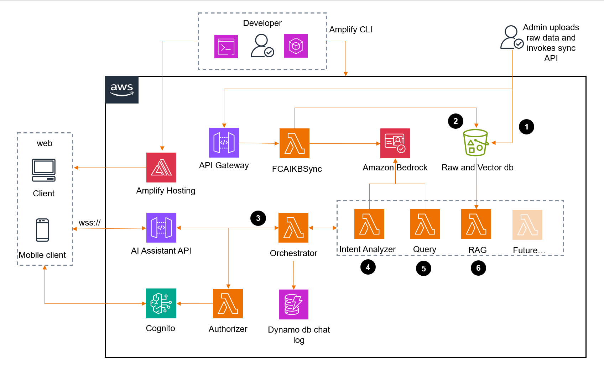

# AI Shopping Assistant

**An AI-powered, serverless shopping assistant backend using AWS Lambda, Amazon Bedrock, S3, DynamoDB, Cognito, and API Gateway.**

---

## Table of Contents

- [Project Overview](#project-overview)
- [Architecture Diagram](#architecture-diagram)
- [Core Components](#core-components)
- [Knowledge Base Vectorization (RAG Pipeline)](#knowledge-base-vectorization-rag-pipeline)
- [Chat Application (Conversational AI)](#chat-application-conversational-ai)
- [How to Test](#how-to-test)
- [Project Structure](#project-structure)
- [Extending & Customizing](#extending--customizing)
- [License](#license)

---

## Project Overview

This backend project powers an AI-based shopping assistant, supporting Retrieval-Augmented Generation (RAG) for product search and conversational shopping. It leverages AWS managed services to provide secure, scalable, and serverless chat and knowledge base enrichment.

---

## Architecture Diagram



## Core Components

### AWS Lambda Functions

- **FCAIKBSynchFunction**: Creates vector embeddings for catalog items using Amazon Bedrock and stores the enriched data in S3.
- **FCAIChatbotLambda**: Main chat logic, integrates Bedrock LLM for AI responses, fetches product info from the vector dump.
- **FCAIChatbotAuthorizer**: Custom Lambda for JWT/Cognito-based authorization of WebSocket connections.
- **FCAIChatbotLambda**: Lambda function that is integrated with websocket API. Responsible for orchatrating the intent analyzer, user query and RAG. Also puts the conversations in dynamo db table.
- **FCAIIntentAnalyserLambda**: Identifies the intent of the user. It classifies the intent in one of the following intents:
- Intents
  - Greetings (e.g. hello, hi, howdy)
  - Gesture (e.g. thumbs up)
  - Feedback (e.g. thanks, thank you)
  - FindProduct (e.g Do you have spring onions? )
  - Recipe (e.g. What salad I make from hydroponic veggies? )
  - Health (e.g. Which fruits and vegetables can help in blood pressure?)
  - GeneralKnowledge (e.g. Why organic vegetables are expensive?)
  - Agriculture (e.g. How hydroponic veggies are grown?)
  - FAQ (e.g. Where are your farms? How to make payments?)
  - Irrelevant (e.g. Which car is fuel efficient?)
  - Objectionable
  - Harmful
- **FCAIQueryLambda**: Based on the intent and query, enriches the query with system prompt and generates the response using bedrock. Currently using nova-micro foundational model.
- **FCAIVectorSearchLambda**: This is a RAG based function that searches the relevant underlying vector database or dump. In this application, it reads the vector dump from S3. Currently it supports two knowledge bases i.e. Product Catalogues and FAQ.
If the results indicate some products those may be sold in store, it performs the cosine similarity search on the catalogue.
If the intent is FAQ and general queries, then it tries to get theinformation from FAQ dump. 

### AWS Services

- **Amazon Bedrock**: Provides both LLM (for chat) and embedding (for vectorization).
- **Amazon S3**: Stores input catalog, enriched vectors, and static assets.
- **Amazon DynamoDB**: Maintains chat history and session context.
- **Amazon Cognito**: Handles user authentication and token issuance.
- **API Gateway (WebSocket API)**: Real-time, bi-directional chat channel.

---

## Knowledge Base Vectorization (RAG Pipeline)

**Purpose:**  
Enhance your product catalog with AI-generated vector embeddings for fast semantic search and RAG-based responses.

**Workflow:**

1. **Input:** Upload your product catalog JSON to S3.
2. **API call:** Trigger the FCAIKBSynch API with the S3 bucket/key.
3. **Embedding:** Lambda loads the catalog, generates embeddings for each product via Amazon Bedrock, and writes back an enriched JSON to S3 under `vectors/`.
4. **Usage:** The chat Lambda later uses this vector dump for retrieval-augmented answers.

**Example API call:**
```json
{
  "bucket": "your-s3-bucket",
  "key": "catalog/products.json"
}
```

**Output:**  
`vectors/products-with-embeddings.json` in the same bucket.

---

## Chat Application (Conversational AI)

**Purpose:**  
Provide a secure, real-time, AI-powered shopping assistant to users.

**Workflow:**

1. **Authentication:**  
   Users authenticate via Cognito; JWT tokens are passed to the backend.
2. **WebSocket Connection:**  
   The client connects to API Gateway (WebSocket) with the token.
3. **Authorization:**  
   Lambda authorizer validates the JWT.
4. **Chat Logic:**  
   Main Lambda receives chat events, uses Bedrock LLM for responses, and performs vector searches on the S3-enriched catalog.
5. **Persistence:**  
   Chat and session data stored in DynamoDB.

**Client Example:**  
`src/chatClient.js` provides a Node.js CLI client for local testing and demonstration.

---

## How to Test

### Prerequisites

- Node.js ≥ 14.x
- AWS credentials with permissions for Lambda, Bedrock, S3, Cognito, DynamoDB, and API Gateway
- Cognito user pool and users set up

### 1. Prepare Knowledge Base

- Upload your product catalog JSON to S3.
- Trigger the vectorization API:
  - (This can be done via API Gateway, AWS Console, or AWS CLI.)

### 2. Run Chat Client

1. Install dependencies:
   ```bash
   npm install ws readline @aws-sdk/client-cognito-identity-provider
   ```
2. Edit `src/chatClient.js`:
   - Set your Cognito `REGION`, `CLIENT_ID`, `USERNAME`, and `PASSWORD`.

3. Run:
   ```bash
   node src/chatClient.js
   ```

4. Type messages in the terminal; type `exit` to quit.

---

## Live Demo in Flutter app hosted on AWS Amplify
For Live demo please use below link - 
- https://fc-ai-assistant.d3gbfa04s89ewa.amplifyapp.com/
- Use below test credentials 
    - use mobile number - +91 8787878787
    - use pincode - 400601
    - use verification code (OTP) - 123456
- Navogate to Chat page. Last icon on bottom navigation bar.
- Try it.. add some products to cart within the chat window. 
- On the top right hit the bag icon and jump to Checkout

## Project Structure

```
amplify/backend/function/
  ├── FCAIKBSynchFunction/      # Vectorization Lambda
  ├── FCAIChatbotLambda/        # Main chat Lambda
  ├── FCAIChatbotAuthorizer/    # WebSocket/Lambda authorizer
  └── FCAIIntentAnalyserLambda/ # (Optional) Intent analysis
src/
  └── chatClient.js             # Node.js chat test client
```

---

## Extending & Customizing

- Swap or fine-tune the Bedrock models for different domains.
- Add new Lambda functions for additional AI flows.
- Integrate the backend with your web/mobile frontend using the same authentication and WebSocket protocol as the provided client.
- Use DynamoDB data for analytics or personalization.

---

